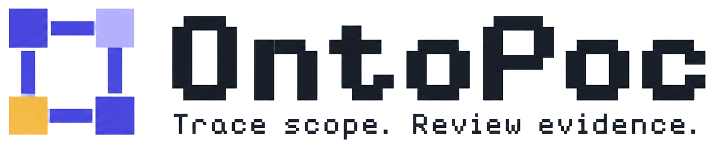

<picture>
  <source media="(prefers-color-scheme: dark)" srcset="landing-page/public/assets/ontopoc-logo.png">
  
</picture>

# OntoPoc — Trace scope. Review evidence.

English · [中文](README.zh-CN.md)

After a recall is issued, which similar complaints fall outside its scope? OntoPoc answers that question for a quality engineer from two public sources, NHTSA recall notices and owner complaints:

1. A model proposes an ontology from field names and sample values only; code verifies the proposal against every record (17 kinds of error) and sends errors back, three attempts at most.
2. Category names that exist in only one source go to the model for an alias; code keeps an alias only when it links more records, and every candidate that depends on one is marked.
3. For each recall, code computes the covered model years and the same-part complaints in three buckets (inside this recall, covered by another same-part recall, outside every one), dated before or after the recall. Recalls that name an earlier recall as the repair they redo are chained into a series.
4. The model gives a first verdict on each complaint text; "same failure" must quote the complaint, and code checks the quote is really there.
5. A quality engineer reviews each candidate on a static page. The reviews are the labels that will calibrate step 4.

Verified on Chevrolet Bolt EV / EUV 2017–2023 (13 recalls, 679 complaints, fetched 2026-09-13) and Hyundai Kona Electric / Kona EV 2019–2021 (4 recalls, 112 complaints, fetched 2026-09-14). No customer data, no VIN-level scope, no deployment yet.

Data comes from the NHTSA public API. OntoPoc is not affiliated with NHTSA, General Motors or Hyundai; its candidates and first-pass verdicts are not official findings or defect determinations.

History: the project started on 2026-08-29 as a pre-sales POC proposal compiler and went through supply-chain, synthetic quality and food-recall scenarios before settling on recall scope review on 2026-09-13. The retired lines were removed from the branch; the full state before removal is tagged `archive-2026-09-13-nhtsa-review`.

> Before developing, read the [guardrails](docs/DEVELOPMENT_GUARDRAILS.md). Current state and next steps: [handoff](docs/HANDOFF_2026-09-13.md), [feature inventory](docs/FEATURES_2026-09-13.md), [iteration 2 requirements](docs/PRD_ITERATION_2.md). These documents are in Chinese.

## Pages

```bash
cd landing-page && npm ci && npm run dev -- --host 127.0.0.1 --port 5178 --strictPort
```

Open `http://127.0.0.1:5178`. Since 2026-09-14 the default entry is "Upload to ontology" (plan: `docs/PRD_ITERATION_3.md`). You upload a business table (Excel or CSV) or a document (Markdown, text, Word or PDF), get a company ontology built automatically, and see three evaluations:

- how well the ontology fits the data (for documents: whether every item quotes the text);
- whether it can answer business questions (the model writes the queries, code answers them on the data);
- how it compares with a reference ontology written by a person.

The ontology tab is a graph with an evidence inspector, and data problems are marked on the nodes. Uploading the same file again lists what changed since the previous run. Uploads and questions need the local modeling service; without it, two bundled demo results can be opened: a synthetic manufacturing company's workbook and its after-sales process document.

```bash
# local modeling service (port 8767, needs a local DeepSeek key; files and results stay in output/ontology-runs/)
PYTHONPATH=src python -m ontology_poc_generator.ontology_server
# run one file from the command line
PYTHONPATH=src:. python scripts/run_company_ontology.py --file examples/company/demo_company.xlsx --output output/demo-run.json
# regenerate the synthetic demo workbook
PYTHONPATH=src:. python scripts/make_demo_company.py
```

The recall scope review is now the example entry "Example: vehicle recalls". It reads static files under `landing-page/public/data/` (an index plus one file per dataset: Chevrolet Bolt EV / EUV 2017–2023 and Hyundai Kona Electric / Kona EV 2019–2021) and needs no Python service. A left sidebar switches between the two entries; recall scope review has four tabs: Data scope (check how the data was read, judge each name mapping; the auto-built ontology sits under technical details) → Recalls (grouped by part, re-recalls chained into series) → Review (ordered by after-recall, fire/crash, date; arrow keys and 1/2/3 work) → Results (agreement with the model, reviewer name, download). Reviews live in the local browser; they are local records, not approvals. The page text is Chinese.

`/landing` is the product page. The second entry, "Public recall lookup", matches products and lots for openFDA event 95876 and needs the local Python service below.

## Commands

```bash
PYTHONPATH=src python -m unittest discover -s tests -q            # backend tests
npm --prefix landing-page run test:unit                             # frontend tests
npm --prefix landing-page run build && npm --prefix landing-page run test:sites
PYTHONPATH=src:. python scripts/build_public_review_pack.py --check # every dataset in the index still matches its run

# add a dataset, in order (steps 3 and later need a local DeepSeek key, see handoff §4; never commit keys)
# 1. snapshot a make, models and years from NHTSA
PYTHONPATH=src:. python scripts/fetch_nhtsa_snapshot.py \
  --make chevrolet --model "bolt ev" --model "bolt euv" --years 2017-2023 --output examples/nhtsa/<snapshot>.json
# 2. list the recall campaigns in that snapshot
PYTHONPATH=src:. python scripts/run_public_ontology.py --snapshot examples/nhtsa/<snapshot>.json
# 3. online run on the same snapshot: build the ontology, then scope and first verdicts for the campaigns you pick
PYTHONPATH=src:. python scripts/run_public_ontology.py --snapshot examples/nhtsa/<snapshot>.json \
  --campaign 20V701000 --campaign 18V576000 --output output/public-ontology-<time>.json
# 4. keep the run, publish the page data (also updates landing-page/public/data/index.json), check it
cp output/public-ontology-<time>.json examples/nhtsa/runs/<name>.json
PYTHONPATH=src:. python scripts/build_public_review_pack.py --report examples/nhtsa/runs/<name>.json --snapshot examples/nhtsa/<snapshot>.json
PYTHONPATH=src:. python scripts/build_public_review_pack.py --check
# 5. the dataset now appears in the page's dataset picker

# after a review: add the download to the label store, then compare rule, model and rule-then-model (counts only)
PYTHONPATH=src:. python scripts/import_reviews.py --input <dataset>-review.json --reviewer <code name>   # writes examples/labels/ (public repo: complaint ids and verdicts, no complaint text or VINs)
PYTHONPATH=src:. python scripts/compare_judgments.py --labels examples/labels/<dataset>.jsonl

# rerun the model's first calls on a recorded run's inputs and count how many change (needs the key)
PYTHONPATH=src:. python scripts/check_stability.py --report examples/nhtsa/runs/<name>.json --snapshot examples/nhtsa/<snapshot>.json --output output/stability-<time>.json

# event 95876 local service and CLI
PYTHONPATH=src python -m ontology_poc_generator.recall_server
PYTHONPATH=src python -m ontology_poc_generator.recall_cli --product F-0369-2025/1 --lot X7547814
```

## Code map

| File | Role |
|---|---|
| `src/ontology_poc_generator/nhtsa_sources.py` | fetch, dedupe, per-source date normalisation, snapshot validation and hash, recall references |
| `src/ontology_poc_generator/public_ontology.py` | field catalog, ontology verification (17 error codes), object graph, build loop, value aliases |
| `src/ontology_poc_generator/public_scope.py` | scope query, before/after timing, complaint text check with quote gate |
| `src/ontology_poc_generator/public_review_pack.py` | page data: groups, series, candidates, blind-spot counts |
| `src/ontology_poc_generator/review_labels.py` | review downloads → label store; the fire-keyword rule; rule / model / rule-then-model counts |
| `src/ontology_poc_generator/model_gateway.py`, `recognition.py` | OpenAI-compatible gateway and the model call contract |
| `src/ontology_poc_generator/recall_*.py` | event 95876 lookup (scope table, matching, local server, DeepSeek extraction check) |
| `landing-page/src/PublicRecallReview.jsx`, `publicReviewModel.js` | review page and its pure functions |
| `landing-page/src/RecallWorkspace.jsx`, `recallWorkspaceModel.js` | event 95876 workbench |
| `landing-page/src/App.jsx` | product page |
| `examples/nhtsa/` | snapshot and recorded online runs |

## Limits

Scope stops at model year; public recall data has no VIN. Model verdicts are first calls with no human-labelled regression set yet. Verified on one dataset; the four roles (event, affected object, mechanism, signal) fit recall-versus-complaint scope, not arbitrary questions. Names that differ across sources are bridged only by verified aliases; anything not bridged is still missed, and the page reports how many complaints entered no candidate list. A review does not mean a defect is confirmed, a vehicle recalled or anything dispositioned.

License: MIT.
