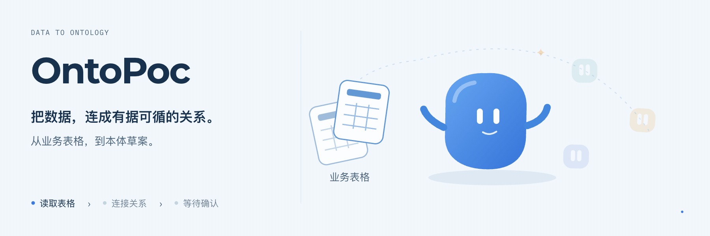
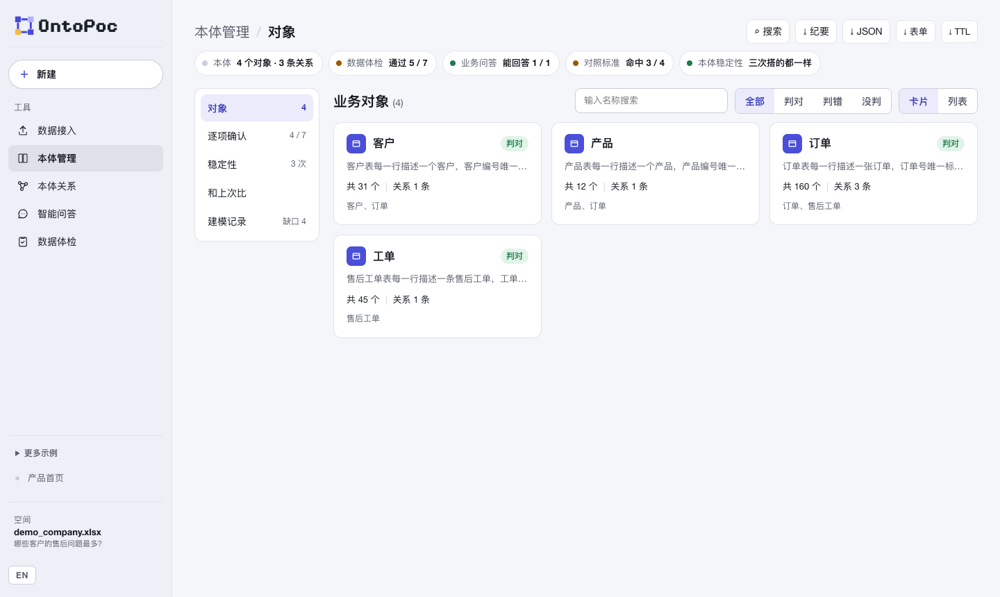
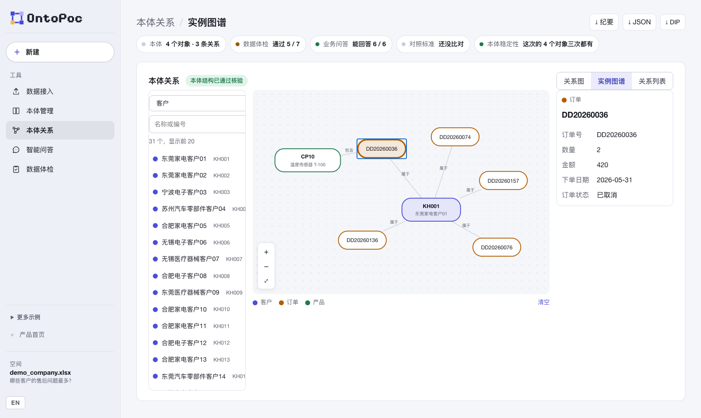
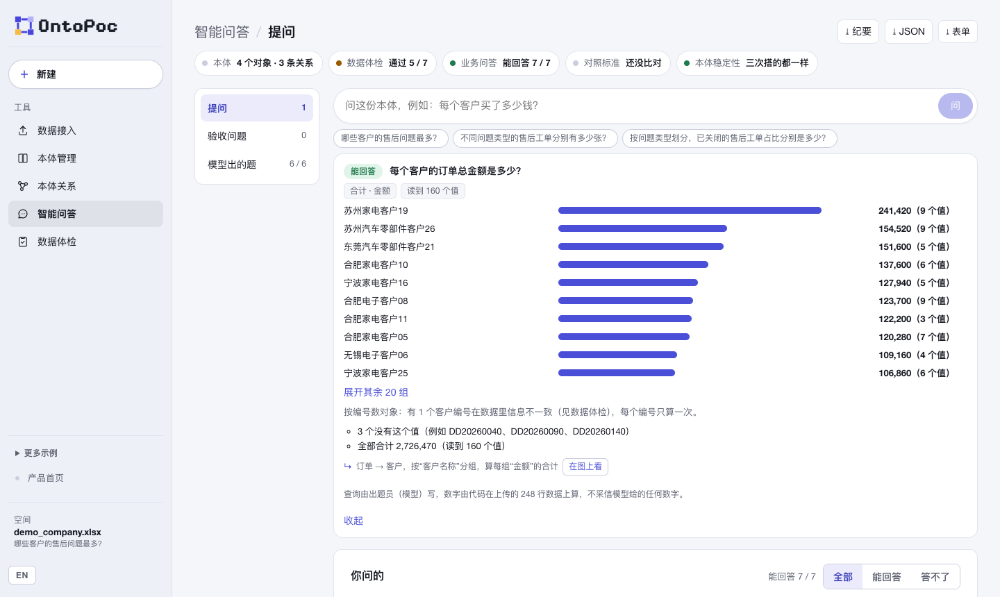
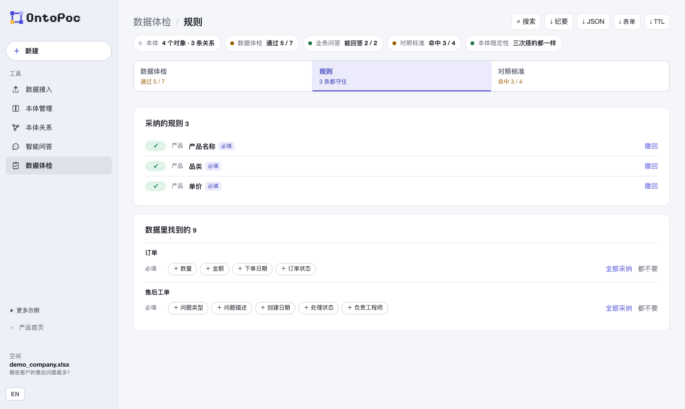

<p align="center">
  <picture>
    <source media="(prefers-color-scheme: dark)" srcset="landing-page/public/assets/ontopoc-logo.png">
    
  </picture>
</p>

<h1 align="center">OntoPoc</h1>
<p align="center"><strong>从业务数据自动生成本体草案，并为每一项给出可核验的证据。</strong></p>
<p align="center">面向数据平台的实施顾问，用于首次接触客户数据时梳理业务对象及其关系。</p>

<p align="center">
  <a href="LICENSE"></a>
  
  
  
  
</p>

<p align="center">
  <a href="README.en.md">English</a> ·
  <a href="#快速开始">快速开始</a> ·
  <a href="#快速体验">快速体验</a> ·
  <a href="#参与共建">参与共建</a>
</p>

<p align="center">
  
</p>
<p align="center"><sub>功能主题插画 · <a href="docs/media/ontopoc-poster.png">静态版</a> · <a href="docs/media/ontopoc-motion.mp4">MP4</a></sub></p>

常见做法是由大模型直接生成本体，其正确性难以判断。OntoPoc 将模型的作用限定为提出方案：每一项均由代码对照全部数据逐行校验，再经人工确认。

**原始文件留在本机** · **所有数值均由代码计算** · **不修改源数据**

## 简介

用户上传若干业务表（Excel、CSV）或一份流程文档后，OntoPoc 生成本体草案，包括业务中的对象、各对象的识别字段以及对象之间的关系。代码随后逐行校验草案：字段是否存在、识别字段是否有值、关系能否在数据中连通。在此基础上，系统执行数据质量检查，并基于数据回答业务问题。文档也可按「组织架构」读，梳理出组织单元、岗位、人与工作环节及其隶属、协作、交接关系，每条都附原文出处。顾问逐项确认后，结果将被保存；同一文件或其新版本再次上传时，系统以此为基准进行比对。

建模结果可按数据平台的对象表单导出，也可按 W3C 标准导出为 Turtle（OWL 与 SHACL）；全部功能也已封装为 MCP 工具，可供其他 Agent 调用。

> **早期版本。** 目前仅在公开数据和合成数据上验证过（芝加哥市政合同、Northwind、BART 地铁、台湾公司登记、CMS 医院等），尚无作者以外的用户独立完成全流程；仅在 macOS 上测试；尚未在任何数据平台上实测批量导入。详见[已知问题](#已知问题)。

## 界面预览

<p align="center"></p>
<p align="center"><sub>本体管理：示例工作簿生成的 4 个业务对象，顶部为数据体检、问答与稳定性状态。</sub></p>

<p align="center"></p>
<p align="center"><sub>实例图谱：由客户 KH001 展开至其订单，再由订单展开至产品；右侧为所选订单的原始字段值。</sub></p>

<p align="center"></p>
<p align="center"><sub>智能问答：模型将问题转写为结构化查询，数值由代码基于上传数据计算，并注明参与计算的值数。</sub></p>

<p align="center"></p>
<p align="center"><sub>数据规则：代码从数据中发现候选规则，采纳后每次重新运行均会校验。</sub></p>

以上截图均基于仓库内置的合成示例 `examples/company/demo_company.xlsx`，由无头浏览器离屏渲染。

## 工作原理

| 操作 | 系统行为 |
|---|---|
| 上传数据表并填写建模目的 | 模型仅读取每列字段名及至多 3 个示例值，提出对象、识别字段与关系；代码按 17 类错误校验，不通过则退回修改，至多 3 轮 |
| 建模完成 | 同一文件并行建模 3 次，标出三次结果不一致之处，即模型不确定、需人工判断的部分；建模目的里写了问题的，一并用数据算出答案，可直接存为验收问题 |
| 打开"数据体检" | 代码逐行执行 7 项检查，例如同一编号的属性是否冲突、每张上传的表是否均被使用 |
| 智能问答 | 模型将问题转写为结构化查询，由代码基于数据计算答案；无法回答时说明原因：本体缺失、数据缺失或查询不支持。也可以让模型按需出一组 6 道题 |
| 逐项确认、重命名、补充对象 | 保存为该文件的参考本体，再次上传时自动比对并预填 |
| 设定验收问题（至多 3 道） | 每次重新运行以相同查询复算，仅提示结果发生变化的问题 |
| 采纳数据规则 | 每次重新运行均校验，列出违反规则的对象 |
| 标记上传文件为新版本 | 沿用上一版的确认、验收问题与规则，并统计各对象的新增与减少数量 |
| 生成对象表单草稿 | 一次模型调用，生成中文名称、描述与展示字段；人工修改过的内容不会被再次生成覆盖 |
| 导出对象表单 | 每个对象生成一份 CSV，列为数据平台建对象时的常见表单列 |
| 点击右上角"⤓ TTL" | 导出三份 Turtle 文件：`ontology.ttl` 用 OWL 描述对象、字段、关系与识别字段；`data.ttl` 中每个对象按识别值命名，同一对象跨表、跨版本同名，可直接合并；`shapes.ttl` 将已采纳的规则写成 SHACL，可用通用校验器检查。判错的对象与关系不导出 |

模型只负责判断，循环与计算均由代码完成；模型调用串联至多 3 步，每次调用都对应一个需要人来做的判断。系统共有 6 个 Agent，定义见 [docs/AGENTS.md](docs/AGENTS.md)。

## 快速体验

完成安装（见[快速开始](#快速开始)）后，可用仓库内置的合成示例体验：

| 操作 | 预期结果 |
|---|---|
| 不启动建模服务，点击"打开示例数据表" | 显示内置结果：4 个对象、3 条关系 |
| 上传 `examples/company/demo_company.xlsx`，建模目的填写"哪些客户的售后问题最多？" | 约半分钟至一分钟后生成客户、产品、订单、售后工单 4 个对象；数据体检 5 / 7 项通过，未通过的 2 项即示例中预置的问题；"业务问答"显示这道题已用数据答出 |
| 在智能问答中提问"每个客户的订单总金额是多少？" | 按客户排序的合计金额，最高为 241,420，共计 160 个值 |
| 本体关系 → 实例图谱，选择一个客户 | 以图谱展示该客户及其订单，点击订单可继续展开产品 |
| 点击右上角"⤓ 表单" | 下载压缩包，内含 4 份对象表单 CSV 及一份导入说明 |

## 快速开始

环境要求：Python 3.11+、Node 22+，以及 DeepSeek API key。

### 方式 A：由 AI 助手安装

将以下内容粘贴至 Claude Code 或 Codex：

```text
请在本机安装并运行 OntoPoc（https://github.com/Longado/ontopoc）：
1. 阅读仓库的 README.md，按"快速开始"操作。
2. 检查 python3 --version ≥ 3.11、node --version ≥ 22；不满足时告诉我安装方法，并暂停后续步骤。
3. 克隆仓库，在 landing-page 目录执行 npm ci。
4. 向我索取 DeepSeek API key，仅写入当前终端的环境变量 DEEPSEEK_API_KEY，不要写入任何文件。
5. 在仓库根目录启动建模服务：PYTHONPATH=src python3 -m ontology_poc_generator.ontology_server
6. 另开一个终端启动页面：cd landing-page && npm run dev -- --host 127.0.0.1 --port 5178 --strictPort
7. 打开 http://127.0.0.1:5178，上传 examples/company/demo_company.xlsx，告诉我"数据体检"通过了几项。
```

### 方式 B：手动安装

```bash
git clone https://github.com/Longado/ontopoc.git && cd ontopoc
(cd landing-page && npm ci)

# 终端 1：建模服务（端口 8767，结果保存在 output/ontology-runs/）
export DEEPSEEK_API_KEY=你的key
PYTHONPATH=src python3 -m ontology_poc_generator.ontology_server

# 终端 2：页面
cd landing-page && npm run dev -- --host 127.0.0.1 --port 5178 --strictPort
```

访问 `http://127.0.0.1:5178`。未配置 key 时仍可查看内置示例。修改后端代码后需重启建模服务，页面检测到服务运行旧代码时会提示。

### 接入 Claude Code 或其他 MCP 客户端

页面上的每项功能都有对应的 MCP 工具，共 27 个。这些工具与页面共用同一个本机服务，可在 Claude Code 等客户端中直接调用：

```bash
claude mcp add ontopoc -- env PYTHONPATH=$PWD/src python3 -m ontology_poc_generator.mcp_server
```

工具清单见 [docs/MCP.md](docs/MCP.md)。

## 功能模块

| 模块 | 内容 |
|---|---|
| 数据接入 | 每张上传表的行数、跳过的标题行，以及各列的类型、长度、填充率；表之间未连通时，提示可用于关联的列 |
| 本体管理 | 对象卡片（支持搜索、按确认结果筛选、卡片与列表视图）；对象详情页：概览、属性（即对象表单）、数据（分页浏览、导出 CSV）、确认；另含逐项确认、稳定性、历史比对、版本比对与建模记录 |
| 本体关系 | 自动布局的关系图（支持拖拽与缩放）、实例图谱、关系列表；代码从数据中发现、本体中尚未包含的关系以虚线标示为建议 |
| 组织架构 | 上传公开研究材料时选「组织架构」：组织树、协作交接（箭头上写明交接内容）、角色表、时期、材料未说明之处；可导出 Mermaid 组织图，按年份段分别出图 |
| 智能问答 | 自由提问、验收问题、模型生成的问题（可按能否回答筛选） |
| 数据体检 | 7 项数据检查、数据规则、与参考本体比对 |

仓库另附一个应用示例：用同一方法研判车辆召回范围（基于 NHTSA 公开数据），入口位于侧边栏"更多示例"，说明见 [docs/RECALL_EXAMPLE.md](docs/RECALL_EXAMPLE.md)。OntoPoc 与 NHTSA 及任何汽车厂商无关联，候选结果不构成缺陷认定。

## 隐私

- 上传的文件及全部结果仅保存在本机 `output/ontology-runs/` 目录。
- 发送给模型（DeepSeek）的内容仅包括：各列字段名及至多 3 个示例值；生成问题时，取值不超过 12 种的列的全部取值；文档则为正文，每次至多 12 段。上传前可在页面逐列查看将发送的内容。
- 每次模型调用在本机 `output/ontology-runs/model_calls.jsonl` 记录一行（Agent、耗时、成功与否），不记录调用内容。
- 服务仅接受本机请求。

## 已知问题

- **建模结果存在随机性。** 同一文件三次建模结果常有差异，例如 Northwind 数据中 8 个对象仅 4 个在三次中均出现。差异之处会在页面中标出，由人工判断。
- **新旧版本的识别字段可能变化。** 芝加哥合同数据曾有一次由"合同号 + 修订号"改为仅用合同号识别，此时只能比较数量，无法逐一比对，页面会注明"识别方式已变更"。
- **关系推断的召回有限。** 在 17 份已保存的运行（公开数据与合成数据）上逐条移除关系后重新推断，33 条中找回 24 条；在完整本体上未出现误报。
- **查询能力的限制。** 暂不支持按数值条件筛选、限定时间范围、单个问题返回两个数值，以及"哪些项目经常同时出现"一类问题；遇到时系统会如实说明。
- **批量导入尚未实测。** 导出的表单列按数据平台的常见表单整理，但导入格式、主键规则与关系表达因平台而异，尚未在任何平台上实测，因此暂不导出关系表。
- **TTL 仅用 rdflib 与 pyshacl 读回验证过。** 尚未在 Protégé 或图数据库中实际导入。
- **仅在 macOS 上测试。** Windows 与 Linux 尚未测试。

## 参与共建

**业务人员能否自行读懂、修正本体，并在后续工作中持续使用？**

| 方向 | 可贡献的内容 |
|---|---|
| 用户研究 | 邀请一位非作者的顾问独立完成从上传到导出纪要的全流程，记录受阻环节 |
| 数据质量 | 规则发现目前仅支持"必填"与"日期先后"两类，取值范围、非负等规则需先在真实数据上验证定义 |
| 平台对接 | 在具体数据平台上实测批量导入，补充关系表导出 |
| 提示词评测 | 从本机运行结果中选取已确认样本作为标注集，实现新旧提示词的一键对比 |
| 跨平台 | 在 Windows、Linux 上完整运行，并以 issue 形式反馈问题 |

欢迎提交 issue 或 pull request。开发前请先阅读[开发规范](docs/DEVELOPMENT_GUARDRAILS.md)。

## 开发

```bash
PYTHONPATH=src python3 -m unittest discover -s tests -q      # 后端测试（546 个）
npm --prefix landing-page run test:unit                       # 前端测试（205 个）
PYTHONPATH=src:. python3 scripts/run_company_ontology.py --file examples/company/demo_company.xlsx --output output/demo-run.json
PYTHONPATH=src python3 -m ontology_poc_generator.ontology_server --data-dir /tmp/ontopoc-trial   # 试跑用另一个数据目录，不动已有运行
PYTHONPATH=src:. python3 scripts/make_demo_company.py         # 重新生成合成示例工作簿
```

| 文档 | 内容 |
|---|---|
| [docs/PRODUCT.md](docs/PRODUCT.md) | 产品定位与范围 |
| [docs/AGENTS.md](docs/AGENTS.md) | 6 个 Agent 的定义与调用记录 |
| [docs/MCP.md](docs/MCP.md) | 27 个 MCP 工具 |
| [docs/PLATFORM_FORM_REFERENCE.md](docs/PLATFORM_FORM_REFERENCE.md) | 数据平台对象表单对照 |
| [docs/PRD_ITERATION_7.md](docs/PRD_ITERATION_7.md) | 最近一轮迭代的计划与执行记录 |
| [docs/DEVELOPMENT_GUARDRAILS.md](docs/DEVELOPMENT_GUARDRAILS.md) | 开发红线与待触发的方向 |

## 许可证

[MIT](LICENSE) © Yutai Lin
