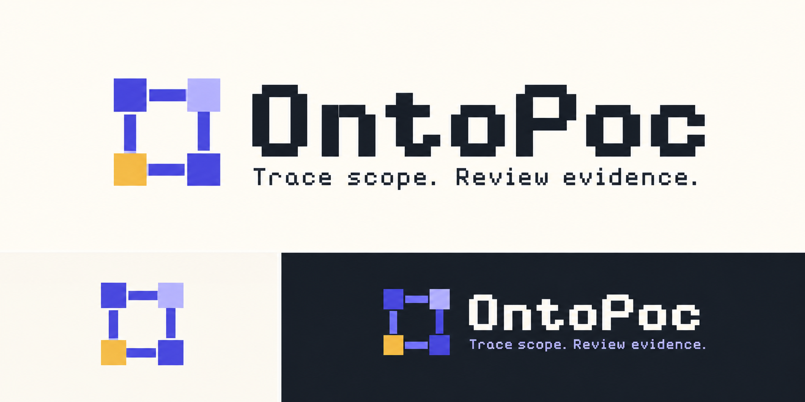

# OntoPoc 接力文档 · 2026-09-13

> 从这里接手。本文记录当前状态、用户已确认的方向、已验证能力及下一轮边界。此前 `DEVELOPMENT_HANDOFF.md` 是历史阶段资料；本文件补充其后的公开召回与工作台迭代，不抹去旧阶段的边界。

## 1. 当前接到哪一步

- 用户确认：本次像素 Logo 概念稿可以，要求提供接力文档。
- 工作台已经做过两次实际审查，结论是局部结构重构；尚未实施该重构。
- 最近一次对外代码推送：`codex/recall-scope-deepseek`，HEAD `3f3e2b1a179bad60db80a3e0b58e4ad4922f3b94`。
- 2026-09-13 实查远端：该分支与本地代码 HEAD 一致；`main` 为 `e92a748f0f009df658524c7b2bc4fbb6e2097932`，这些开发分支改动尚未合并至 main。
- 本接力文档与 Logo 归档是上述提交之后的新文件；不能因代码分支此前已推送，就认为本文件也已推送。
- 本轮没有部署。公开静态站没有本地 Python API，不能把 GitHub 推送理解为线上功能已更新。

### 工作目录

```text
主仓库：本机 clone 根目录
当前开发工作树：.worktrees/recall-scope-deepseek
当前分支：codex/recall-scope-deepseek
GitHub：https://github.com/Longado/ontopoc
```

主仓库存在独立的 README、前后端对齐文档、landing-page 未提交改动，属于其他工作。不要覆盖、清理、重置，也不要把当前工作树的内容直接覆盖回主仓库。

## 2. 产品方向与已确认视觉

建议统一业务定位：**质量事件范围研判助手**。

质量异常发生后，帮助质量工程师核对相关对象，识别匹配、信息冲突和证据缺口，形成带依据、可人工复核的待确认清单。质量负责人确认业务处置，FDE/实施人员负责材料与数据映射。

现状存在三种叙述：官网讲供应链规则变化后的持续影响分析，README 讲工业决策编译，默认工作台做固定食品召回核对。后续应统一业务叙述，保留技术底座说明，但不能把目标能力写成已交付。

### 用户已接受的 Logo 概念稿



- 文件：`docs/assets/ontopoc-pixel-logo-concept-v1.png`。
- 图形：四个关联方块构成 O，黄色节点表示正在核对的对象；独立图形，借鉴 Working Corpus 的像素质感。
- 名称：`OntoPoc`；标语：`Trace scope. Review evidence.`。
- 用户已接受此稿的方向。无需重新从三套风格开始设计。
- 这是带浅色/深色应用展示的整张 PNG 概念板，尚非可直接用作 favicon 的生产文件；尚未替换网站现有 Logo。
- 之后制作透明底标识、单色版和小尺寸图标，检查 16/32px 可辨性。像素风用于标识及适量标题，业务表格和正文优先可读性。

## 3. 当前实际功能

| 能力 | 已实现 | 边界 |
|---|---|---|
| 公开召回匹配 | 产品、批号、UPC、可选标签日期；matched / insufficient / conflict / not_matched；原文依据 | 仅历史事件 95876，未匹配不代表安全 |
| 前端事件清单 | 新增、Tab 分隔粘贴，最多 100 行；逐行修正、重算、分类计数 | 不能导入企业业务字段，不能自助添加其他事件 |
| 人工复核 | 理由、需补证事项、经办人备注 | 本地备注，不是身份认证、审批或业务回执 |
| 本地恢复与导出 | localStorage 保存；已保存复核恢复；来源变更作废旧结果；损坏草稿不覆盖；JSON 摘要 | 不同步多人；未保存的复核编辑切行会丢失 |
| 工业质量演示 | 固定合成快照、五类对象范围、依据、人工选择、候选建模 | 固定演示，不能输入任意事件完成建模 |
| Python/CLI 底座 | DecisionPack、OntologySpec、合成事实验证；DeepSeek 公告提取对照测试 | 公开公告路径与合成工业路径不同；没有统一的新材料前端流程 |

始终区分：**系统已核对 / 人工已复核 / 业务已处理**。当前不具备第三项的执行与回执。

## 4. 代码地图

| 文件 | 职责 |
|---|---|
| `landing-page/src/StandaloneDemo.jsx` | 场景入口、语言、核对期间切换限制 |
| `landing-page/src/RecallWorkspace.jsx` | 清单、导入、请求编排、选择/筛选、详情、复核、本地恢复、下载 |
| `landing-page/src/recallWorkspaceModel.js` | 草稿结构、解析、逐行变更、复核校验、恢复、汇总和 API 客户端 |
| `landing-page/src/RecallWorkspace.css` | 召回工作台样式；亦包含合成材料折叠样式 |
| `landing-page/src/DocumentModeler.jsx` | 固定材料只读、合成范围结果与候选关系 |
| `landing-page/src/documentModelingDemoModel.js` | 同质量快照对应的预设对象和关系 |
| `src/ontology_poc_generator/recall_scope.py` | 公告范围加载/校验和确定性匹配 |
| `src/ontology_poc_generator/recall_server.py` | 本地 catalog GET 与 match POST；监听 8766 |
| `src/ontology_poc_generator/recall_extraction.py` | DeepSeek 提取与人工核对表比较 |
| `scripts/check_recall_deepseek.py` | 显式在线实测，逐条输出报告 |
| `examples/recalls/95876.openfda.json`、`95876.scope.json` | 真实原始公告及核对后的范围表 |

旧问题台账 `docs/PM_INTERACTION_ISSUES.md` 的“已实施并验证”描述第一轮验收；不代表后来发现的长列表、筛选和草稿问题也已修复。台账中的“尚未提交”也是历史状态，以本文第 1 节为准。

## 5. 最新问题：都还没有修复

| ID | 问题与复现 | 最小改进 |
|---|---|---|
| WB-01 | 先选匹配行，再筛选冲突；列表仅剩冲突行，详情却仍为原匹配行 | 筛选、选择和详情一致；没有可见行时清空详情 |
| WB-02 | 导入 24 行，点第 24 行；桌面详情标题处于视口上方约 2110px，眼前右侧空白 | 列表与详情合理滚动，选择后详情立即可访问 |
| WB-03 | 第 24 行填写复核理由但不保存；切第 1 行再返回，理由变空 | 独立保留编辑草稿，不能自动把草稿当已确认复核 |
| WB-04 | 390px 下 24 行列表把详情推到约 4218px 以下 | 手机采用列表/详情切换，返回恢复原位置 |
| WB-05 | 企业六列记录含单据号、SKU、仓库、数量、产品、批号，被四列解析器拒绝 | 下一轮保留企业业务元数据，显式映射查询字段 |
| WB-06 | 普通清单没有删行入口，无业务字段搜索或下一条未复核 | 支持误导入行处理与连续复核 |
| WB-07 | EN 只翻译标题/导航，表单、状态与提示仍中文 | 统一语言覆盖或明确当前中文范围 |
| WB-08 | 缺信息/冲突可“认可核对结果”，但没有业务事项完成状态 | 说明复核的对象是系统判断；后续补证状态单独设计 |

### 本地审查证据

这些目录在 `.gitignore` 的 `output/` 下，当前机器可读，新 clone 不会自动获得：

- `output/product-review-2026-09-12/report.html`：第一次功能与定位复核。
- `output/workbench-review-2026-09-12/report.html`：24 行工作台重构复核，5 张已查看截图。
- `output/interaction-verification-2026-09-12/`：第一轮已保存复核、恢复和下载验证。

换机器时即使没有截图，也可按上表复现；不要把截图缺失当作已修复。

## 6. 下一轮：先做操作可靠性

> **2026-09-13 已改方向**：用户定为"公开场景跑通 + 自动搭建本体"，下一轮按 `docs/NHTSA_AUTO_ONTOLOGY_PLAN.md` 第 4 节执行。本节和第 7 节保留作历史记录；WB-01 并入新方案 C 轮，WB-02～08 暂缓。

**Pain：** 连续复核时容易看错行、找不到详情、丢失未保存理由。

**Outcome：** 用户在 24 行中连续选择、筛选和复核，始终看到正确对象，草稿可继续。

**范围：** WB-01/02/03/04。保持既有 API 和确定性匹配，保留已保存草稿的恢复兼容性。

**最小文件集：** `RecallWorkspace.jsx`、`RecallWorkspace.css`、`recallWorkspaceModel.js`、对应测试；确需分离时再增加局部清单/详情组件。以实际职责分离为准，不为拆文件而拆文件。

**本轮不纳入：** 企业字段、新事件提取、Logo 网站替换、后端规则重构、真实连接器、正式审批、云部署、通用状态管理/工作流框架。

### 实施步骤

1. 读取项目护栏，检查工作树与最新提交；记录本轮计划、边界、验收条件。
2. 先写失败用例：筛选隐藏当前选中项；空筛选；切行保留复核草稿；修改查询后旧结果与已确认复核失效。
3. 统一局部选择、筛选和复核编辑状态。未提交的编辑与已确认复核分开保存；不得静默提升草稿状态。
4. 修复桌面详情可见性与手机返回清单路径，保持对象名称/行号可见，验证键盘焦点。
5. 验证旧草稿迁移/恢复、损坏草稿保护、来源变化后重算；不要静默丢弃旧数据。
6. 运行相关测试和构建，再走真实浏览器验收；回填问题状态。

### 验收

- 24 行匹配、缺信息、冲突各 8 行；筛选后详情必属于可见对象，空筛选没有旧详情。
- 点第 1/12/24 行，桌面详情立即可见，手机可以进入详情并返回原位置。
- 填写未保存复核理由 → 切行 → 返回，草稿仍可继续，但不计入“已复核”。
- 更改查询条件，旧结果/正式复核失效；其他行保持不变。
- 刷新后已保存内容恢复；兼容旧草稿；保存失败不虚报成功。
- 所有改动直接支持本轮目标；无新增生产依赖、凭据或其他工作树文件。

## 7. 后续更新路线

| 轮次 | 内容 | 验收 |
|---|---|---|
| 1 | 上述操作可靠性 | 24 行连续处理不看错、不丢草稿 |
| 2 | 企业原单据号、SKU、位置、阶段、数量/单位，导入映射、删除恢复、业务可读导出 | 同批号不同单据保持独立，结果回到原记录；不同单位不混加 |
| 3 | 第二个公开事件：原文 → DeepSeek 候选 → 人工纠正 → 范围版本 → 核对 | 用户无需改代码即可复用；缺来源/校验失败不能应用 |
| 4 | 目标质量用户试用授权案例 | 对照表格流程，记录时间、漏项、人工修正与补证情况 |
| 5 | Logo 生产素材、官网/README、演示录屏统一 | 描述与当前实际功能一致 |

Logo 定稿可作为独立小任务提前进行，但不能取代工作台可靠性；本轮用户只确认了概念稿，不代表整站重设计已获验收。

企业模拟的 6 行 / 420 件是人工构造场景：匹配 200、缺信息 60、冲突 70、未匹配 90。数量汇总发生在模拟脚本，不是已上线 UI 功能，也不是客户库存或试用成效。

## 8. 启动与验证

在当前开发工作树根目录执行。使用已验证的 `python`（本机 3.13）；系统 `python3` 曾因版本过旧导致测试失败。

```bash
python --version
PYTHONPATH=src python -m ontology_poc_generator.recall_server
```

另一终端：

```bash
cd landing-page
npm run dev -- --host 127.0.0.1 --port 5178 --strictPort
```

本地入口 `http://127.0.0.1:5178`。启动前确认端口是否已有服务，不重复启动或随意停止其他进程。新 clone 尚未安装依赖时按项目现有依赖配置安装。

```bash
PYTHONPATH=src python -m unittest discover -s tests -q
npm --prefix landing-page run test:unit
npm --prefix landing-page run build
npm --prefix landing-page run test:sites
PYTHONPATH=src python scripts/generate_demo_artifact.py --check
PYTHONPATH=src python scripts/generate_quality_investigation_artifact.py --check
git diff --check
```

Sites 测试依赖构建产物，先 build 再 test:sites。最近一次 2026-09-12 回归为 318 Python + 101 前端 + 4 Sites = 423 项通过；另 10 组真实本地 HTTP 请求通过。这是历史验证，不是本接力文档编写时重跑。Vite 有主包 >500kB 警告，不是本轮性能改造授权。

浏览器工具已验证：`npx --offline --yes agent-browser --session <专用测试名> ...`。点击前使用新 snapshot；使用专用会话，勿覆盖用户草稿。桌面 1440×1000、手机 390×844。

## 9. DeepSeek 凭据与实测

用户已提供并授权本机保存/测试；不要再次让用户在对话粘贴密钥。

- 本机文件：`~/.local-sensitive/ontopoc/deepseek.env`，文件 0600、目录 0700，位于仓库外。
- 只读该文件供进程使用，不打印内容，不复制进仓库、截图、日志、文档或提交。
- 若换机器没有该文件，说明缺少本机配置，请用户通过安全本地配置补齐；不要声称“历史未提供”。
- 核对 API 本身不调用模型；在线提取实测是独立脚本。

在当前工作树根目录，从安全本地文件加载到子 shell：

```bash
(
  set -a
  source ~/.local-sensitive/ontopoc/deepseek.env
  set +a
  PYTHONPATH=src python scripts/check_recall_deepseek.py \
    --model deepseek-flash \
    --output "output/recall-deepseek-$(date +%Y%m%d-%H%M%S).json"
)
```

不要使用 `set -x`。报告路径必须是新文件，脚本拒绝覆盖。输出报告也应检查无凭据。

最近一次实际在线测试：`output/product-review-2026-09-12/deepseek-live-145756.json`。2026-09-13 编写本文时重新读取确认：完成 5/5 条，实际模型 `deepseek-flash`，12 产品分组、93 条产品—批号对应，总模型耗时 23.139 秒，差异为零。输入只有公告编号、产品描述、批号原文，没有标准答案。

此结果只证明该组公告的提取对照通过；不证明任意材料泛化、质量根因、企业影响传播或前端在线建模已经完成。

## 10. Git 与交付约定

- 保留其他工作树改动；不要把本地 `output/`、凭据文件或真实客户数据加进 Git。
- 当前全局 pre-commit 要求“修改已有测试”和“产品实现”分开提交；其测试识别不覆盖 `.test.mjs`。此前提交拆成两个测试提交和一个功能提交，未绕过钩子。
- 推送只针对已核对范围。合并 main、部署、外部消息分别确认其授权，不把“写接力文档”当成这些动作的授权。
- 交付时说明改了什么、验证了什么、未完成什么；更新台账前先复现验证。

### 可直接转交给下一位 agent

> 请先读 `docs/NHTSA_AUTO_ONTOLOGY_PLAN.md`、`docs/HANDOFF_2026-09-13.md` 与 `docs/DEVELOPMENT_GUARDRAILS.md`，确认当前工作树和分支。接下来执行方案第 4 节的 A 轮：把试验代码 `experiments/nhtsa_auto_ontology/` 的取数、自动搭建本体、代码核验、对象图、范围查询、文本判断做进仓库，先确认能否输出成现有 `OntologySpec` / `implementation_map`，不另起一套权威结构。先写失败测试（录好的 NHTSA 快照 + 录好的模型输出），再实施；在线运行做成独立脚本。不混入页面、标注集、企业字段或部署。DeepSeek 本机凭据位置见第 9 节，禁止输出密钥。先检查已有改动，不覆盖其他工作树。
