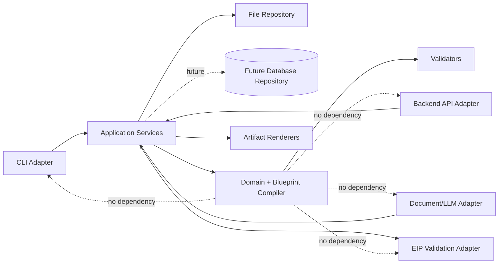
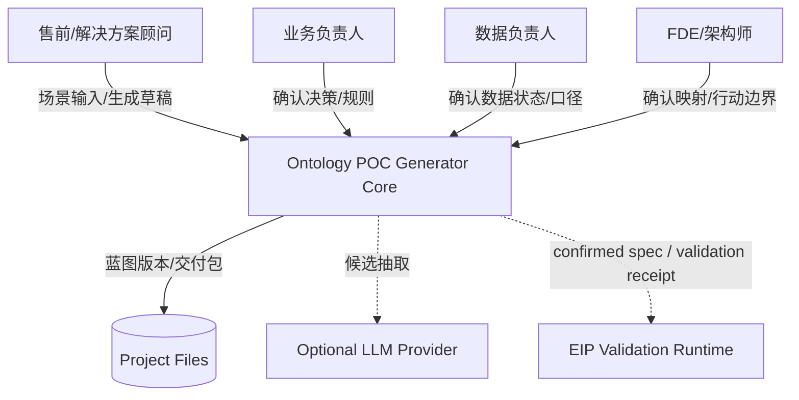

# Persistent AI FDE Decision Compiler 技术架构

**版本：** v0.1  
**状态：** Re-anchoring Draft
**日期：** 2026-08-29  
**适用范围：** DecisionPack、知识辅助编译、本体规格、校验、版本、映射、血缘、决策与适配边界
**明确不包含：** 前端页面、视觉、交互和组件设计

## 1. 架构目标

> 2026-08-29 重锚说明：当前实施顺序以 [渐进式 EIP 重建总计划](superpowers/plans/2026-08-29-incremental-eip-reconstruction.md) 为准。本文后续原有的“Studio 对接旧 EIP”章节属于重锚前候选设计，将在对应 Loop 进入时逐段替换，不代表当前接口承诺。

本架构服务新的最小可信路径。愿景是 **Persistent AI FDE**，核心资产是不可变 `DecisionPack`；首个黄金主决策是“哪些订单进入优先干预队列”，处置动作延后到 Loop 6：

```text
结构化场景输入
-> 有来源的 DecisionPack
-> 新仓 OntologySpec
-> synthetic facts + stateless validation
-> hash-bound ValidationReceipt
-> review / confirm / publish baseline
-> revised candidate pack / spec / receipt
-> DecisionDelta + immutable version + human review
-> confirm / publish next version
-> 后续数据映射、血缘、裁决与受控行动
```

技术目标：

1. 用一个类型化 `DecisionPack` 作为设计、验证与治理的共同事实源，`ProjectBlueprint` 是其设计投影；
2. 把业务推导集中在 compiler，renderer 只负责格式化；
3. 严格区分建议、人工确认、机器求值、版本生命周期和运行能力；
4. 相同规范化输入产生相同内容身份和稳定输出；
5. 无客户数据、无授权或无验证证据时，不得升级证据状态；
6. 核心不依赖前端、LLM、旧 EIP、Neo4j 或数据库服务；
7. 保持当前 CLI 和两个示例的兼容迁移路径；
8. 先实现本仓自己的无状态 EIP 验证纵切面，再讨论旧 EIP 兼容、Web 和企业基础设施；
9. Loop 4 同时保留结构 semantic diff 和业务 DecisionDelta；没有真实用户纠正或复用 DecisionDelta 的证据，不进入 Loop 5–7。

## 2. 当前事实与目标能力

### 2.1 当前已实现

- JSON 场景输入；
- 严格必填、boolean 与数据源状态校验；
- `Proposal` 值对象；
- 显式关系语义：关系端点必须引用已声明对象；未提供关系时报告信息不足，不按对象顺序推断；
- Markdown 和 JSON 输出；
- CLI；
- 乳品研发、供应链异常两个合成样例；
- 25 项 unittest。

### 2.2 当前未实现

- Loop 1 及以上的有来源知识建议、`DecisionPack`、`OntologySpec`、验证运行时、审查与版本能力；
- `ProjectBlueprint`；
- 类型化 Actor、Relation、Constraint、Evidence、Finding、Action；
- candidate 审查与 confirmed handoff；
- PRD renderer；
- Acceptance Matrix renderer；
- 版本与 diff；
- EIP 适配器；
- 规则运行、Agent 编排、任务执行和回执；
- 客户数据授权与验证。

### 2.3 架构原则

文档中的目标架构不是当前能力声明。任何输出必须通过 capability ledger 区分：

```text
implemented       已有代码和测试证明
planned           计划建设，当前不可执行
requires_review   已生成候选，需要人工确认
requires_data     缺少数据或授权
requires_runtime  需要 EIP 或其他运行环境验证
verified          已有对应验证回执
```

### 2.4 Loop 契约所有权

| Loop | 本轮拥有 | 明确不提前拥有 |
|---|---|---|
| 1 | source/binding/suggestion 稳定身份、`SourceRef / KnowledgeUnit / KnowledgeSuggestion / KnowledgeOutcome`、不可变 `DecisionPack`、canonical pack content hash | Action、规则执行、事实结果、review、version、publication |
| 2 | `OntologySpec` 稳定类型、domain/range、规则输入绑定、引用闭包、canonical spec content hash；保留 candidate/draft 状态 | 事实运行和版本治理 |
| 3 | synthetic facts、四态结果、绑定 pack/spec/facts 内容 hash 的 `ValidationReceipt` | 发布和外部副作用 |
| 4 | pack 版本/base、review、publication、结构 semantic diff、published/candidate receipt 的 `DecisionDelta` | 生产数据连接、Action、API |

Loop 1 的默认 CLI 不加载知识包，保持 Loop 0 输出。只有显式 `--knowledge-unit` 才增加 candidate 建议。知识包声明匹配规则，核心 Python 不出现行业名称特判。

> 第 3–24 节保存重锚前的参考架构候选。其中出现的“当前”“MVP”“本阶段”以及 blueprint repository、完整 CLI、API、LLM/EIP adapter 等措辞不构成当前承诺；只有 ROADMAP 与已批准的 dated Loop plan 能授权实现。当前只执行第 25 节所列 Loop 1 技术门。

## 3. 架构风格

采用领域核心优先的六边形架构：



依赖规则：

```text
adapters -> application -> domain
renderers -> domain read models
infrastructure -> application ports
domain -> Python standard library only
```

禁止反向依赖：

- domain 不导入 CLI、FastAPI、数据库或 EIP 客户端；
- renderer 不做关系建议、验收推导或状态升级；
- adapter 不复制领域校验；
- LLM 不直接创建 `confirmed` 元素；
- EIP 回执不自动覆盖 Studio 的人工确认状态。

## 4. 系统上下文



MVP 的运行闭环只到本地交付包；LLM 和 EIP 都是可选端口。

## 5. 核心组件

| 组件 | 职责 | 不负责 |
|---|---|---|
| Intake Parser | 读取 JSON/YAML 兼容输入，形成原始命令 | 业务推导 |
| Input Validator | 类型、必填、枚举、交叉字段校验 | 自动补写未知事实 |
| Blueprint Compiler | 规范化、稳定 ID、候选建议、引用连接 | 文档排版 |
| Blueprint Validator | 引用闭包、状态、可求值性、交付准备度 | EIP 真实数据运行 |
| Governance Service | 追加 verdict，产生 confirmed 投影 | 多人通知和复杂权限 |
| Version Service | checksum、版本、base、diff | Git 分支合并 |
| Artifact Projector | 从蓝图产生只读 artifact model | 新的业务推导 |
| Renderers | Markdown/JSON/CSV 格式化 | 修改蓝图状态 |
| Package Builder | 生成 manifest 和交付包 | 声称计划工件已存在 |
| Repository Port | 保存、读取蓝图和追加记录 | 决定具体存储技术 |
| EIP Port | 创建验证草稿、提交验证、读取回执 | 发布、行动执行和外部写回 |

## 6. 领域模型

### 6.1 聚合根

```python
@dataclass(frozen=True)
class ProjectBlueprint:
    blueprint_id: str
    version_id: str
    base_version_id: str | None
    schema_version: str
    status: BlueprintLifecycle
    content_checksum: str
    evidence_mode: EvidenceMode
    scene: BusinessScene
    actors: tuple[Actor, ...]
    decisions: tuple[Decision, ...]
    object_types: tuple[ObjectType, ...]
    relation_types: tuple[RelationType, ...]
    data_sources: tuple[DataSource, ...]
    data_requirements: tuple[DataRequirement, ...]
    constraints: tuple[Constraint, ...]
    evidence: tuple[Evidence, ...]
    findings: tuple[Finding, ...]
    action_contracts: tuple[ActionContract, ...]
    acceptance_cases: tuple[AcceptanceCase, ...]
    deliverable_specs: tuple[DeliverableSpec, ...]
    capabilities: tuple[CapabilityClaim, ...]
```

`ProjectBlueprint` 保存结构化事实和候选建议，不保存已经渲染的 Markdown。

### 6.2 稳定身份

所有可审查元素实现：

```python
@dataclass(frozen=True)
class ElementIdentity:
    element_id: str       # 创建后不可变，如 obj:01J...
    semantic_key: str     # 场景内稳定业务键，如 object:customer_order
    label: str            # 可改显示名称
```

规则：

- 改 label 不改变 `element_id`；
- 删除再新增产生新 ID；
- 同一蓝图内 semantic key 唯一；
- renderer 使用 label，引用使用 ID；
- diff 以 ID 为主键，不以数组位置或名称为主键；
- 自关系必须显式声明，不能由对象顺序推导。

### 6.3 业务场景与决策

```python
@dataclass(frozen=True)
class BusinessScene:
    scene_id: str
    industry: str
    name: str
    problem_statement: str
    scope_in: tuple[str, ...]
    scope_out: tuple[str, ...]
    source_refs: tuple[str, ...]


@dataclass(frozen=True)
class Decision:
    decision_id: str
    name: str
    trigger: str
    decision_object_ids: tuple[str, ...]
    owner_actor_id: str
    option_labels: tuple[str, ...]
    output_definition: str
    downstream_action_ids: tuple[str, ...]
    governance_status: GovernanceStatus
    source_refs: tuple[str, ...]
```

主决策完整性约束：

```text
trigger
+ decision object
+ owner
+ at least two explicit outcomes or one typed output
+ downstream action or explicit no-action boundary
+ at least one acceptance case
```

复合决策检测只产生 warning，不自动拆分。用户必须选择主决策，其余成为 supporting decision 或独立蓝图。

### 6.4 Actor

```python
class ActorResponsibility(str, Enum):
    BUSINESS_OWNER = "business_owner"
    DATA_OWNER = "data_owner"
    TECHNICAL_OWNER = "technical_owner"
    REVIEWER = "reviewer"
    ACTION_ASSIGNEE = "action_assignee"


@dataclass(frozen=True)
class Actor:
    actor_id: str
    display_name: str
    responsibilities: tuple[ActorResponsibility, ...]
    scope_element_ids: tuple[str, ...]
```

MVP 不做账号认证，但必须记录“哪个责任角色有权确认哪类元素”。

### 6.5 本体对象与关系

```python
@dataclass(frozen=True)
class ObjectType:
    object_type_id: str
    semantic_key: str
    label: str
    description: str
    identifier_property: str | None
    governance_status: GovernanceStatus
    source_refs: tuple[str, ...]


@dataclass(frozen=True)
class RelationType:
    relation_type_id: str
    semantic_key: str
    predicate: str
    source_object_type_id: str
    target_object_type_id: str
    source_cardinality: Cardinality
    target_cardinality: Cardinality
    inverse_predicate: str | None
    governance_status: GovernanceStatus
    source_refs: tuple[str, ...]
```

不得重新引入 Loop 0 修正前“数组相邻即存在关系”的推断。关系来源只能是：

1. 用户显式输入；
2. 行业模式库建议，状态为 `candidate`；
3. 材料抽取建议，状态为 `candidate` 且必须有 source ref。

### 6.6 数据、规则、证据与发现

```python
class DataAvailability(str, Enum):
    UNKNOWN = "unknown"
    TO_CONFIRM = "to_confirm"
    AVAILABLE = "available"
    UNAVAILABLE = "unavailable"


class AuthorizationStatus(str, Enum):
    UNKNOWN = "unknown"
    NOT_REQUIRED = "not_required"
    PENDING = "pending"
    AUTHORIZED = "authorized"
    DENIED = "denied"


class DataValidationStatus(str, Enum):
    NOT_RUN = "not_run"
    VALID = "valid"
    INVALID = "invalid"


@dataclass(frozen=True)
class DataSource:
    data_source_id: str
    name: str
    source_type: str
    availability: DataAvailability
    authorization: AuthorizationStatus
    validation_status: DataValidationStatus
    owner_actor_id: str | None
    snapshot_id: str | None
    checksum: str | None
    source_refs: tuple[str, ...]


@dataclass(frozen=True)
class DataRequirement:
    requirement_id: str
    business_term: str
    data_source_id: str | None
    table_or_resource: str | None
    field_or_expression: str | None
    temporal_coverage: str | None
    quality_expectation: str | None
    owner_actor_id: str | None


@dataclass(frozen=True)
class Constraint:
    constraint_id: str
    name: str
    expression_kind: str
    expression: dict
    required_input_ids: tuple[str, ...]
    governance_status: GovernanceStatus
    evaluation_status: EvaluationStatus
    source_refs: tuple[str, ...]


@dataclass(frozen=True)
class Evidence:
    evidence_id: str
    evidence_kind: str
    subject_element_ids: tuple[str, ...]
    source_ref_id: str
    evidence_status: EvidenceStatus


@dataclass(frozen=True)
class Finding:
    finding_id: str
    constraint_id: str
    subject_element_ids: tuple[str, ...]
    evidence_ids: tuple[str, ...]
    evaluation_status: EvaluationStatus
    summary: str
```

求值准备度：

```text
required input missing/unavailable/unauthorized -> not_evaluable
expression kind unsupported                    -> unsupported
inputs ready and condition satisfied           -> pass
inputs ready and condition violated            -> fail
```

Studio MVP 只计算“是否具备求值条件”，不对真实客户数据执行 EIP 业务规则。

### 6.7 人工裁决

```python
@dataclass(frozen=True)
class Verdict:
    verdict_id: str
    blueprint_version_id: str
    element_id: str
    verdict: GovernanceStatus
    reason: str | None
    reviewed_by_actor_id: str
    reviewed_at: str
```

约束：

- verdict 只追加，不修改旧记录；
- `rejected` 和 `insufficient` 必须有 reason；
- confirmed 投影由最新合法 verdict 计算；
- 数据 owner 只能确认数据状态；
- business owner 确认决策和业务规则；
- technical owner 确认映射和行动合同；
- MVP 可让一个人兼任多个角色，但责任类型必须存在。

### 6.8 行动合同

```python
@dataclass(frozen=True)
class ActionContract:
    action_id: str
    name: str
    triggered_by_decision_id: str
    assignee_actor_id: str
    approver_actor_id: str | None
    target_system_boundary: str
    parameters_schema: dict
    preconditions: tuple[str, ...]
    expected_effect: str
    receipt_definition: str
    failure_definition: str
    rollback_definition: str | None
    capability_status: CapabilityStatus
    governance_status: GovernanceStatus
```

Studio 只声明行动合同，不执行行动。输出必须使用“建议行动/拟验证行动”；只有 EIP 或其他运行系统回传 receipt 后才能显示 executed。

### 6.9 验收用例

```python
@dataclass(frozen=True)
class AcceptanceCase:
    acceptance_id: str
    question: str
    decision_id: str
    preconditions: tuple[str, ...]
    input_requirement_ids: tuple[str, ...]
    execution_steps: tuple[str, ...]
    expected_observations: tuple[str, ...]
    failure_conditions: tuple[str, ...]
    evidence_artifact_ids: tuple[str, ...]
    owner_actor_id: str
    readiness: AcceptanceReadiness
    governance_status: GovernanceStatus
```

`AcceptanceReadiness`：

```text
draft       结构未完整
blocked     缺数据、能力或责任人
ready       前置项完整，可进入演示/验证
verified    已有运行回执和人工验收
```

不能用“演示结果可回答”作为统一通过条件。

## 7. 三条独立状态轴

### 7.1 元素治理状态

```text
candidate -> confirmed
          -> rejected
          -> insufficient
```

表示“人是否确认该方案元素”。

### 7.2 蓝图版本生命周期

```text
draft -> submitted -> validated -> confirmed -> superseded
                 \-> rejected
```

表示“整份蓝图处于什么阶段”。

### 7.3 机器求值状态

```text
pass | fail | not_evaluable | unsupported
```

表示“规则是否能算、算出来是什么”。

三条状态轴不得互相覆盖：

- EIP 验证失败不自动撤销业务人员对概念语义的 confirmed；
- 元素 confirmed 不代表蓝图版本 confirmed；
- 蓝图 confirmed 不代表 EIP published；
- pass 不代表人工批准；
- rejected 不代表规则 fail。

## 8. 证据状态

废弃单一 `customer_data_available: bool`，使用：

```python
class EvidenceMode(str, Enum):
    SYNTHETIC = "synthetic"
    CUSTOMER_PROVIDED = "customer_provided"
    CUSTOMER_AUTHORIZED = "customer_authorized"
    VALIDATED_FOR_POC = "validated_for_poc"
```

状态升级条件：

| 状态 | 必要条件 |
|---|---|
| synthetic | 默认，无客户数据事实 |
| customer_provided | 至少一个数据源有明确来源 |
| customer_authorized | 数据 owner 和授权记录存在 |
| validated_for_poc | 有数据快照、checksum 和验证回执 |

状态不能由调用者直接声明最终值；compiler 根据证据计算最大允许状态。

## 9. 编译管线


### 9.1 Parse

- 只接受 JSON object 作为根；
- 拒绝 NaN、Infinity 和非标准 JSON；
- 保留输入路径用于错误定位；
- 不在该阶段推断业务含义。

### 9.2 Validate Types

- 严格 boolean；
- 严格枚举；
- 数据源 name/type/status 必填；
- 返回所有字段错误，不只返回第一个；
- 错误包含 `path/code/message/current/allowed`。

### 9.3 Normalize

- 去除首尾空白；
- Unicode 规范化；
- 规范 semantic key；
- 对集合字段排序；
- 重复对象按 semantic key 报错；
- 不改变业务文字内容。

### 9.4 Assign Stable IDs

- 新建元素生成稳定 ID；
- 重新编译已存在蓝图时复用匹配 ID；
- 匹配使用显式 semantic key，不使用数组位置；
- 模板建议使用命名空间 ID。

### 9.5 Build Explicit Graph

- 只接受显式关系或可追溯的模式建议；
- 所有引用必须指向存在元素；
- 过滤 rejected 元素后重新检查引用闭包；
- 缺失引用是 blocking error。

### 9.6 Derive Candidates

可派生：

- 缺少决策 owner；
- 数据责任人待补；
- 关系模式候选；
- 规则 required input 候选；
- 验收用例缺失项；
- capability gap。

不得派生：

- 客户数据已授权；
- 业务规则已确认；
- 客户效果已实现；
- 外部系统允许写回；
- EIP 已验证或已发布。

### 9.7 Validate References

检查：

- ID 唯一；
- semantic key 唯一；
- relation domain/range；
- constraint required inputs；
- finding evidence；
- decision owner/actions；
- acceptance decision/data/evidence；
- deliverable dependency；
- confirmed handoff 引用闭包。

### 9.8 Compute Readiness

分别计算：

- blueprint readiness；
- data readiness；
- rule evaluation readiness；
- acceptance readiness；
- EIP export readiness。

输出 blocker、warning、candidate，不生成单一健康分。

## 10. 校验与错误模型

```python
@dataclass(frozen=True)
class ValidationIssue:
    issue_id: str
    severity: Literal["blocking", "warning", "info"]
    code: str
    path: str
    element_id: str | None
    message: str
    current_value: object | None
    allowed_values: tuple[str, ...]
    suggested_action: str | None
```

示例代码：

```text
INPUT_ROOT_NOT_OBJECT
BOOLEAN_TYPE_INVALID
DUPLICATE_SEMANTIC_KEY
RELATION_SOURCE_MISSING
RELATION_TARGET_MISSING
CONSTRAINT_INPUT_MISSING
DATA_UNAVAILABLE
DATA_UNAUTHORIZED
ACCEPTANCE_OWNER_MISSING
ACCEPTANCE_NOT_READY
CAPABILITY_NOT_IMPLEMENTED
EIP_MAPPING_INCOMPLETE
STALE_BASE_VERSION
```

CLI：

```text
0  成功
2  输入或蓝图校验失败
3  输出/存储失败
4  外部适配器失败
```

失败时不覆盖上一次成功交付包。

## 11. 版本、checksum 与 diff

### 11.1 版本包络

```python
@dataclass(frozen=True)
class BlueprintEnvelope:
    blueprint_id: str
    version_id: str
    base_version_id: str | None
    schema_version: str
    compiler_version: str
    created_by_actor_id: str
    created_at: str
    content_checksum: str
    source_manifest_checksum: str
    blueprint: ProjectBlueprint
```

时间存在 envelope 中，不进入 `content_checksum`。

### 11.2 Canonical JSON

- 字典键排序；
- 集合按稳定 ID 排序；
- 列表只有在顺序具有业务语义时保序；
- UTF-8；
- 禁止 NaN/Infinity；
- 时间、运行 ID、输出路径不进入内容 hash；
- SHA-256。

### 11.3 Semantic diff

按 `element_id` 比较：

```text
added
removed
changed
status_changed
reference_changed
```

diff 输出包含 before/after、受影响引用和需要重新审查的 deliverable。

### 11.4 并发和 stale base

文件仓库也必须检查：

```text
command.base_version_id == repository.current_version_id
```

不一致则返回 `STALE_BASE_VERSION`，不得覆盖当前版本。

## 12. 应用服务

```python
class BlueprintApplicationService:
    def create_draft(command: CreateDraft) -> BlueprintEnvelope: ...
    def validate(version_id: str) -> ValidationReport: ...
    def record_verdict(command: RecordVerdict) -> BlueprintEnvelope: ...
    def build_review_package(version_id: str) -> PackageManifest: ...
    def confirm_handoff(command: ConfirmHandoff) -> BlueprintEnvelope: ...
    def render_artifact(version_id: str, artifact_type: str) -> RenderedArtifact: ...
    def diff(before_version_id: str, after_version_id: str) -> BlueprintDiff: ...
```

MVP 的最小服务顺序：

```text
create draft
-> validate
-> record verdict
-> validate confirmed projection
-> build draft review package
```

`confirm_handoff` 只有在 blocker 为零、责任角色完整、引用闭包通过时开放。

## 13. 交付物架构

### 13.1 Artifact model

```python
@dataclass(frozen=True)
class ArtifactSpec:
    artifact_id: str
    artifact_type: ArtifactType
    title: str
    source_element_ids: tuple[str, ...]
    capability_status: CapabilityStatus
    review_status: GovernanceStatus
```

### 13.2 支持顺序

| Artifact | 当前 | 下一阶段 | 条件 |
|---|---|---|---|
| POC Proposal Markdown | implemented | 迁移到 blueprint projector | draft 可生成 |
| Blueprint JSON | planned | 首先实现 | 严格 schema |
| Acceptance Matrix | planned | 第二实现 | acceptance cases 完整 |
| PRD Markdown | planned | 经用户验证后实现 | 证明是优先输出 |
| Data Requirement Matrix | planned | 后续 | data requirement 完整 |
| EIP Spec Envelope | planned | 只读验证阶段 | confirmed + mapping complete |

### 13.3 Draft Review Package

```text
package/
  manifest.json
  blueprint.json
  validation-report.json
  unresolved-items.json
  poc-proposal.md
```

manifest 包含：

- blueprint/version/compiler/schema；
- content checksum；
- evidence mode；
- artifact 实际存在清单；
- candidate、insufficient、blocker 数量；
- 生成时间和生成者；
- `draft_review` 标签。

### 13.4 Confirmed Handoff Package

只有满足 confirmed gate 才生成：

```text
handoff/
  manifest.json
  confirmed-blueprint.json
  validation-report.json
  acceptance-matrix.csv
  poc-proposal.md
  review-ledger.jsonl
```

不存在的工件不能写进 manifest。

## 14. 存储架构

### 14.1 MVP：文件仓库

```text
projects/{blueprint_id}/
  metadata.json
  versions/{version_id}/
    envelope.json
    verdicts.jsonl
    validation.json
  current
  packages/
```

规则：

- version envelope 写入后不可修改；
- verdict 只追加；
- `current` 通过原子 rename 更新；
- 写临时文件、fsync、rename，避免半写；
- checksum 不一致时拒绝读取；
- 上一成功 package 不被失败生成覆盖。

### 14.2 Repository ports

```python
class BlueprintRepository(Protocol):
    def current(self, blueprint_id: str) -> BlueprintEnvelope | None: ...
    def get(self, blueprint_id: str, version_id: str) -> BlueprintEnvelope: ...
    def append_version(self, envelope: BlueprintEnvelope) -> None: ...
    def append_verdict(self, verdict: Verdict) -> None: ...


class ArtifactRepository(Protocol):
    def put_atomic(self, package: ArtifactPackage) -> PackageManifest: ...
    def get_manifest(self, package_id: str) -> PackageManifest: ...
```

### 14.3 数据库迁移条件

只有出现以下条件才增加数据库实现：

- 多进程并发写；
- 多用户共享项目；
- 需要查询跨项目元素；
- 文件锁和原子 rename 不能满足部署环境；
- 真实使用证明版本数量需要索引和分页。

## 15. CLI 和后端 API 边界

### 15.1 CLI

保留：

```text
ontology-poc validate <input>
ontology-poc compile <input> --project <dir>
ontology-poc render <version> --artifact poc
ontology-poc package <version> --kind draft-review
ontology-poc diff <before> <after>
```

当前单命令入口保留兼容别名，内部改为调用 application service。

### 15.2 后端 API

本阶段只定义端口，不建设前端：

```text
POST /api/v1/blueprints
POST /api/v1/blueprints/{id}/versions
POST /api/v1/blueprints/{id}/versions/{vid}/validate
POST /api/v1/blueprints/{id}/versions/{vid}/verdicts
GET  /api/v1/blueprints/{id}/versions/{vid}
GET  /api/v1/blueprints/{id}/versions/{vid}/diff?base={base}
POST /api/v1/blueprints/{id}/versions/{vid}/packages
```

API adapter：

- 把 HTTP 请求转换成 command；
- 调用 application service；
- 把 `ValidationIssue` 转换成稳定错误响应；
- 不直接读写 repository；
- 不包含前端 view model。

MVP 不要求启动 API 服务，CLI 先证明核心合同。

## 16. LLM 适配器

LLM 只允许产生 candidate suggestion：

```python
class CandidateExtractionPort(Protocol):
    def extract(self, source: SourceDocument) -> CandidateBundle: ...
```

`CandidateBundle` 必须包含：

- candidate element；
- source reference；
- extractor/model/prompt version；
- confidence 仅作为排序信息；
- unsupported/insufficient 内容；
- 原始响应 checksum。

安全规则：

- 默认禁用；
- 每项目显式授权；
- 输入数据分类和外传策略前置；
- 客户项目之间隔离；
- 日志不保存敏感正文；
- 提示注入内容只能成为不可信候选文本；
- LLM 不更新 evidence mode；
- LLM 不生成 confirmed verdict。

## 17. EIP 只读验证适配器

### 17.1 首版边界

首版只支持 EIP `pipeline_mapping` 模式，并且只做：

```text
confirmed blueprint
-> EipSpecEnvelope v1
-> create draft
-> structural/rule validation
-> immutable validation receipt
```

不做：

- EIP 自动发布；
- materialization；
- action 执行；
- 外部系统写回；
- 运行差异自动改写 Studio 蓝图。

### 17.2 EipSpecEnvelope v1

```json
{
  "envelope_schema": "eip-spec-envelope/v1",
  "target_mode": "pipeline_mapping",
  "idempotency_key": "sha256:...",
  "blueprint": {
    "blueprint_id": "...",
    "version_id": "...",
    "content_checksum": "..."
  },
  "base_eip_version_id": null,
  "data_snapshot": {
    "snapshot_id": "...",
    "checksum": "..."
  },
  "spec": {
    "entity_types": [],
    "relation_types": [],
    "logic_rules": [],
    "actions": []
  },
  "source_manifest": [],
  "mapping_manifest": []
}
```

导出前检查：

- 全部导出元素 confirmed；
- relation 引用闭包；
- source table/resource；
- entity natural key；
- relation endpoint key mapping；
- rule required inputs；
- source reference；
- data snapshot/checksum；
- stale base。

### 17.3 Validation receipt

```json
{
  "receipt_schema": "eip-validation-receipt/v1",
  "request_id": "...",
  "blueprint_id": "...",
  "blueprint_version_id": "...",
  "export_checksum": "...",
  "eip_spec_version_id": "...",
  "data_checksum": "...",
  "status": "completed",
  "structural": {
    "status": "pass",
    "violations": []
  },
  "rules": {
    "pass": 0,
    "fail": 0,
    "not_evaluable": 0,
    "unsupported": 0
  }
}
```

回执只更新 validation projection，不直接改变人工治理状态。

### 17.4 Capability negotiation

适配器连接前读取或配置 EIP capability：

```json
{
  "versioning": "foundation_only",
  "finding_lineage": "partial",
  "internal_action": "single_set_property_demo",
  "external_writeback": "unsupported"
}
```

Studio 不能依据 PRD 文字假设 EIP 能力存在。

## 18. 安全与客户数据边界

在接入真实客户材料、项目历史或 LLM 前必须完成：

1. 数据分类：public/internal/confidential/restricted；
2. 项目目录隔离；
3. 本地静态加密策略；
4. 密钥不进入仓库或日志；
5. 最小保留期限和删除操作；
6. 导出前敏感字段检查；
7. 日志脱敏；
8. LLM 默认禁用和逐项目授权；
9. 行业模板不吸收客户私有内容；
10. source reference 可以定位但不把敏感原文复制到公共 artifact。

安全出口门未完成前，只允许 synthetic demo。

## 19. 可观测性

核心事件：

```text
input_validated
blueprint_compiled
validation_completed
verdict_recorded
artifact_rendered
package_built
adapter_request_started
adapter_request_completed
adapter_request_failed
```

事件字段：

- run_id；
- blueprint/version；
- compiler/schema version；
- duration；
- issue counts；
- artifact type；
- adapter type；
- error code；
- 不包含客户敏感正文。

指标只反映系统行为：

- 校验耗时；
- blocker/warning 数量；
- renderer 耗时；
- adapter 错误率；
- stale-base 冲突数。

它们不能替代用户价值验证。

## 20. 测试架构

### 20.1 Domain tests

- 稳定 ID；
- 严格 boolean 和枚举；
- 重复 semantic key；
- 关系 domain/range；
- 引用闭包；
- 三条状态轴不可混用；
- evidence mode 升级；
- verdict 追加和责任角色；
- acceptance readiness。

### 20.2 Compiler contract tests

- 同一输入跨进程生成相同 canonical JSON；
- 数组展示顺序变化不产生语义 checksum 变化；
- 改 label 不改变 element ID；
- 不按对象相邻顺序生成关系；
- participants/actions/data 不丢失；
- synthetic 与 customer evidence 矛盾输入被拒绝。

### 20.3 Renderer tests

- renderer 不修改蓝图；
- renderer 不产生新业务元素；
- Markdown 标题、列表、表格上下文正确转义；
- PRD、POC、Acceptance 共享同一 element ID；
- planned capability 不渲染成 implemented；
- golden snapshot 来自完整 compile，而不是复用同一内存对象两次 render。

### 20.4 Repository tests

- append-only version；
- atomic current update；
- stale base；
- checksum corruption；
- 失败 package 不覆盖上一成功版本；
- verdict JSONL 追加。

### 20.5 CLI tests

- 根数组、缺字段、非法枚举、NaN；
- 输入和输出错误码；
- 两个示例端到端；
- Markdown/JSON/package；
- 当前命令兼容。

### 20.6 EIP contract tests

- 缺 natural key；
- 无效 relation endpoint；
- 缺 required input；
- unsupported rule；
- stale EIP base；
- 重复 idempotency key；
- validation receipt checksum；
- EIP capability 不支持时拒绝。

## 21. 目标目录结构

```text
src/ontology_poc_generator/
  domain/
    identity.py
    enums.py
    scene.py
    ontology.py
    data.py
    decision.py
    governance.py
    acceptance.py
    blueprint.py
  application/
    commands.py
    services.py
    ports.py
    errors.py
  compiler/
    parser.py
    normalizer.py
    compiler.py
    readiness.py
  validation/
    input_rules.py
    graph_rules.py
    governance_rules.py
    export_rules.py
  projection/
    poc.py
    acceptance.py
    prd.py
    eip_spec.py
  renderers/
    markdown.py
    json_renderer.py
    csv_renderer.py
  infrastructure/
    file_repository.py
    package_repository.py
  adapters/
    cli.py
    api.py
    llm.py
    eip.py
```

当前仓库不一次性创建全部空模块；按纵向验收切片逐步增加。

## 22. 从当前代码迁移

### Slice 0：修复当前边界

- 严格 boolean；
- 数据源状态枚举并保留 `unavailable`；
- 根 JSON 类型校验；
- Markdown 转义；
- 当前/计划能力标签；
- 输入和输出错误码；
- 不再渲染未经实现的规则、Agent、任务和版本能力。

出口：当前两个样例和错误输入回归通过；客户数据状态不能被弱类型绕过。

### Slice 1：最小蓝图纵向链

只实现：

```text
Decision
-> Actor
-> ObjectType / explicit RelationType
-> Constraint
-> DataRequirement / DataSource
-> AcceptanceCase
```

包含稳定 ID、candidate 状态、引用闭包和 readiness。暂不实现 Finding、Action execution、版本 UI 或 EIP。

出口：两个样例不依赖对象顺序生成关系；数据缺口传播到 constraint 和 acceptance readiness。

### Slice 2：最小人工治理与交付包

- Verdict；
- 责任角色；
- confirmed projection；
- Draft Review Package；
- manifest；
- append-only 文件存储。

出口：未审查元素不能进入 Confirmed Handoff；每个确认有 actor 和 reason 语义。

### Slice 3：选择一个新增输出

在真实任务评审后，只实现 PRD 或 Acceptance Matrix 之一。若尚无用户证据，优先 Acceptance Matrix，因为它能直接检验方法论是否可验收。

出口：新输出与 POC 共享 element ID，修改传播测试通过。

### Slice 4：版本和 diff

- immutable envelope；
- canonical checksum；
- semantic diff；
- stale base；
- 影响输出章节。

出口：修改 label、relation、constraint 或 acceptance 能产生正确 diff，不受数组顺序影响。

### Slice 5：EIP 只读适配

前置条件：EIP 接口、目标模式、capability matrix 和合成契约测试明确。

出口：一份明确标记 candidate/draft 的供应链合成 DecisionPack 完成本仓无状态 validation，并返回绑定 pack/spec/facts 内容 hash 的可校验 receipt；不确认、不发布、不执行行动。旧 EIP 只可作为独立契约参考，不是此前置条件。

## 23. 架构决策记录

### ADR-001：核心使用标准库值对象

原因：当前 CLI 简单、可移植，先验证领域合同，不引入框架耦合。

复审条件：API 层需要成熟 schema 生成或数据库映射；届时 Pydantic 只放适配层，领域模型保持独立。

### ADR-002：ProjectBlueprint 是唯一事实源

原因：避免 POC、PRD 和验收矩阵分别推导后口径漂移。

### ADR-003：文件仓库先于数据库

原因：当前单用户本地 CLI 不需要数据库；文件版本足以验证 append-only 和 stale base。

复审条件：真实多用户并发或跨项目查询出现。

### ADR-004：最小治理前置

原因：candidate 是 P0 语义，不能把审查全部推迟到远期协作功能。

### ADR-005：EIP 首版只读验证

原因：EIP versioning、finding lineage 和 action 当前都是局部能力；先验证契约，不依赖发布和执行。

### ADR-006：不从对象顺序推断关系

原因：展示顺序没有本体语义。

### ADR-007：证据状态由事实计算

原因：调用者自报 boolean 会突破 synthetic demo 边界。

## 24. 停止规则

出现以下任一情况时停止扩张并重新评估：

- 真实任务评审显示主决策、关系或验收条件大部分需要重写；
- 用户首要问题不是方案结构或跨材料一致性；
- 新 renderer 需要自己的业务推导才能工作；
- ProjectBlueprint 为了支持第二行业必须加入行业特判；
- EIP 适配要求复制 EIP 内部数据库表或绕过其版本边界；
- 客户材料接入缺少数据分类、授权和删除机制；
- 输出仍把 planned/requires_validation 写成 implemented/verified；
- 缺少业务 owner、数据 owner 或技术 owner，却试图生成 confirmed handoff。

## 25. 下一步技术门

不进入前端设计。下一步只执行：

1. 按 [Loop 1 详细计划](superpowers/plans/2026-08-29-loop1-sourced-supply-chain-knowledge.md) 实现首个有来源的供应商—物料证据语义知识单元；
2. 保持当前 CLI 为首个 adapter，默认不加载知识包；
3. 用供应链黄金场景证明 knowledge outcome 的 `applicable / not_applicable / insufficient_information` 边界；
4. 通过 Loop 1 出口后再冻结 Loop 2 的 `OntologySpec` 契约；
5. 不进入前端、PRD renderer、数据映射、Action 或 API。
